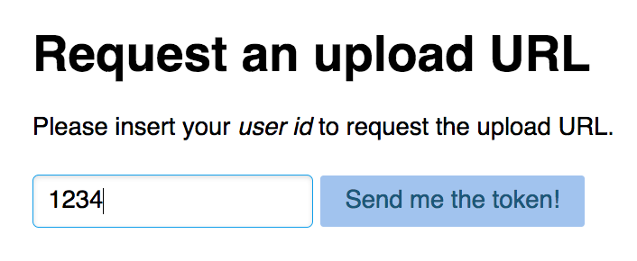
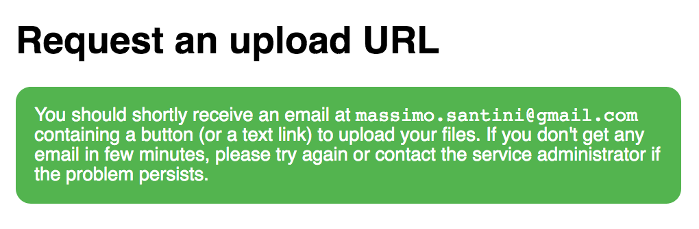
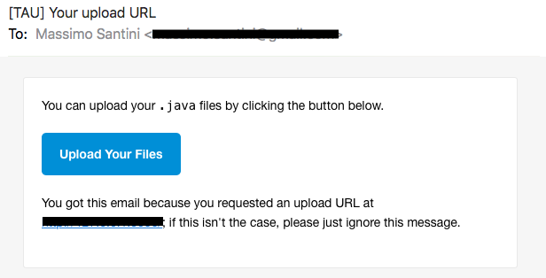
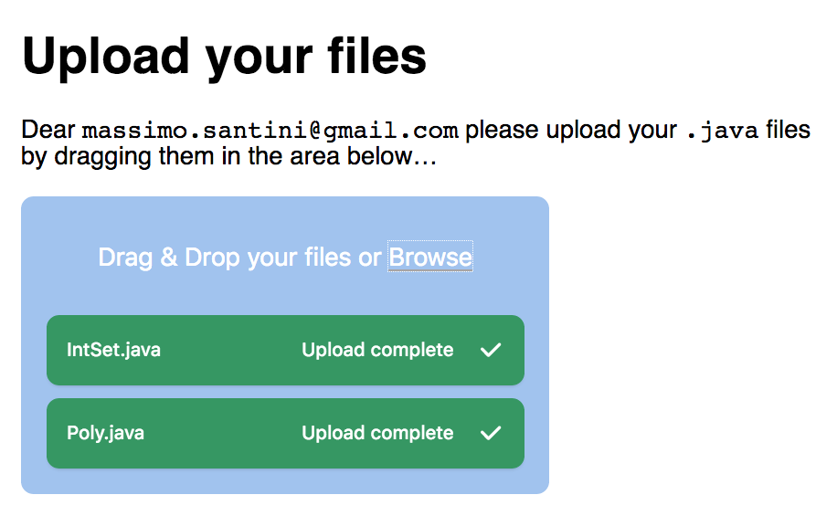

# 𝜏 Token Authenticated Upload

Tau (𝜏) is a simple [Flask](https://palletsprojects.com/p/flask/) base uploading service that authenticates users via (eupload sent) secure tokens generated by [itsdangerous](https://pythonhosted.org/itsdangerous/); the frontend is based on [filepond](https://pqina.nl/filepond/).

## The idea and flow

This tool is primarily intended to collect programming assignments from a list
of known students without the hassle of setting up (and administering) a
*password authentication system* (relying instead on pre-existing email
authentication).

First of all one configures the service with a list of *user id*s (i.e. badge
numbers) and corresponding *email*s; then instruct the students to request their
upload URL by entering their *user id* on the service page

if it corresponds to a registered student, the system will acknowledge it

and send an email to the student, containing an *action* button (or text link)
to submit the files

finally, the students uploads his solutions

The upload button (or link) contains a *token* that is cryptographically signed
and timestamped, so that only legitimate students (for the configured timeframe)
will be able to upload files. The uploaded assignments will be stored in a
separate folder for every student.